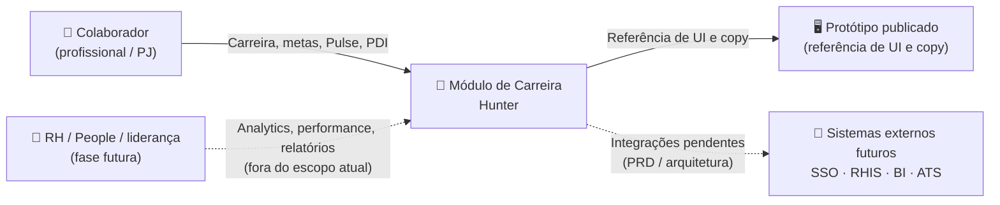

# Arquitetura e decisões

> Decisões técnicas para a fase atual do **Módulo Colaborador** (`/app`). A trilha RH (`/hr`) aparece apenas como fronteira futura — não gera implementação agora.

---

## Visão de contexto (C4 nível 1)

O diagrama abaixo posiciona o sistema em relação a seus usuários e dependências externas. Integrações externas são candidatas — não contratos fechados.

:::note C4 nível 2

O diagrama de contêineres (L2) — que detalha aplicação frontend, backend, banco de dados e serviços externos — está pendente e listado como alta prioridade nas [pendências](#pendências-por-prioridade).

:::

---

## Decisões arquiteturais atuais

| Decisão | O que fica definido | Impacto técnico | Precisa validar |
|---------|---------------------|-----------------|-----------------|
| **Priorizar `/app` na fase atual** | Colaborador é o único módulo em escopo de implementação agora. | Engenharia foca rotas, estados, eventos e dados de `/app`. | Congelar `/hr` como referência até entrar no roadmap. |
| **Separar `/app` e `/hr` por papel de uso** | `/app` concentra ação individual; `/hr` concentra leitura organizacional futura. | Autorização e analytics devem nascer preparados para `role` e `scope`, sem implementar telas RH agora. | Matriz de papéis quando RH entrar no roadmap. |
| **Manter `/app/perfil` como hub de carreira** | Visão geral, jornada, skills, experiência, PDI e avaliações vivem no contexto do perfil. | O front precisa preservar estado de aba; analytics precisa identificar subárea mesmo sem rota dedicada. | Se produção exigirá deep link por aba ou query param. |
| **Dar rotas próprias para PDI e Pulse** | `/app/pdi` e `/app/pulse` são fluxos recorrentes — não apenas abas de perfil. | PDI e Pulse precisam de eventos, permissões e estados independentes. | Persistência, rascunho, edição, histórico e notificações. |
| **Tratar gaps como ponte para PDI** | Gaps devem poder virar meta SMART ou vínculo a meta existente. | Precisa de relação `gap_id → goal_id`, estado de vínculo e auditoria. | Regra para obrigatoriedade, prioridade e fechamento de gap. |
| **Usar Pulse como sinal contínuo, separado de avaliação formal** | Pulse é reconhecimento contínuo; Performance Review e Check são ciclos formais. | Domínios de dados diferentes, com privacidade e retenção diferentes. | Visibilidade do Pulse para gestor/RH e uso em analytics. |
| **Preparar sinais para leitura RH futura** | `/app` deve gerar dados rastreáveis de PDI, Pulse, performance, skills, projetos e squads. | Eventos e modelos de dados devem permitir agregação futura, sem expor leitura RH agora. | Quais dados poderão ser agregados quando `/hr` for priorizado. |

---

## Domínios de dados

| Domínio | Origem documentada | Uso principal | Contrato pendente |
|---------|--------------------|---------------|-------------------|
| **Perfil e identidade** | [Visão geral do perfil](./colaborador/perfil-visao-geral), [Experiência](./colaborador/perfil-experiencia) | Identidade profissional, histórico e contexto de carreira. | Fonte real de cargo, nível, gestor, squad, projetos e histórico. |
| **Competências e gaps** | [Matriz](./colaborador/skills/matriz), [Hard Skills](./colaborador/skills/hard), [Soft Skills](./colaborador/skills/soft), [Gaps](./colaborador/skills/gaps) | Diagnóstico de evolução e entrada para PDI. | Modelo de competência, escala, versionamento e cálculo de gap. |
| **PDI e metas** | [PDI](./colaborador/perfil-pdi) | Compromissos SMART, progresso, ações e checks. | Persistência, rascunho, aprovação, edição, exclusão e histórico. |
| **Feedback e Pulse** | [Pulse](./colaborador/pulse), [Performance Review](./colaborador/perfil-performance-review) | Reconhecimento contínuo e avaliação formal. | Privacidade, anonimato, retenção, moderação e visibilidade por papel. |
| **Projetos e squads** | [Projetos](./colaborador/projetos), [Squads](./colaborador/squads) | Contexto de atuação, alocação e evidência de impacto. | Origem real: PM tool, RHIS, cadastro interno ou input manual. |
| **Analytics RH futuro** | [RH Tech People](./rh-tech-people), [Escopo e métricas](./escopo-metricas) | Insights, relatórios, risco e leitura agregada em fase futura. | Agregação, anonimização, filtros, auditoria e exportação. |

---

## Matriz inicial de visibilidade

| Informação | Colaborador | Gestor | RH / People | Executivo |
|------------|-------------|--------|-------------|-----------|
| Metas PDI próprias | Ver / editar | Ver conforme regra | Ver agregado ou individual com permissão | Agregado |
| Gaps próprios | Ver | Ver conforme regra | Agregado por time/área | Agregado |
| Pulse recebido/enviado | Ver próprios | Parcial, se permitido | Agregado; individual só com regra explícita | Agregado |
| Check de evolução | Ver próprio | Ver liderados | Ver ciclos e agregados | Agregado |
| Performance Review | Ver próprio | Ver liderados | Ver conforme política | Agregado |
| Dados de squads/projetos | Ver contexto | Ver time | Ver organização | Ver agregados |

:::warning Privacidade

A matriz acima é hipótese de arquitetura para fase futura. Na fase atual, implemente apenas o necessário para `/app`. Não implemente leitura individual ou agregada em `/hr` sem decisão explícita de roadmap, privacidade, consentimento, base legal, auditoria e política de retenção.

:::

---

## Eventos mínimos e contratos de analytics

Os eventos abaixo complementam [Escopo e métricas](./escopo-metricas). Eles transformam decisões de arquitetura em instrumentação verificável.

| Fluxo | Eventos mínimos | Propriedades obrigatórias |
|-------|-----------------|---------------------------|
| Dashboard | `dashboard_viewed`, `quick_action_clicked`, `next_step_completed` | `user_role`, `route`, `action_type`, `source_card`, `timestamp` |
| Gaps → PDI | `gap_viewed`, `gap_link_pdi_clicked`, `pdi_goal_created` | `gap_id`, `competency_id`, `goal_id`, `status`, `timestamp` |
| PDI / Check | `pdi_goal_updated`, `pdi_goal_completed`, `check_started`, `check_completed` | `goal_id`, `cycle_id`, `progress`, `owner_role`, `timestamp` |
| Pulse | `pulse_sent`, `pulse_received_viewed`, `pulse_filter_used` | `pulse_id`, `category`, `visibility_scope`, `timestamp` |
| RH futuro | `hr_overview_viewed`, `people_insight_opened`, `report_viewed`, `action_created_from_insight` | **Não instrumentar nesta fase** — manter como referência de roadmap. |

---

## Integrações candidatas

| Integração | Para quê | Pergunta de arquitetura |
|------------|----------|-------------------------|
| **SSO / diretório** | Autenticação, identidade, papel e vínculo organizacional. | Quem é o provedor? Como mapear colaborador, gestor, RH e admin? |
| **RHIS** | Cargo, nível, gestor, área, histórico e vínculo. | Qual sistema é fonte da verdade? Como tratar PJ e múltiplas alocações? |
| **BI / data warehouse** | Relatórios, analytics e histórico agregado. | O módulo escreve eventos ou consome modelos prontos? |
| **ATS / mobilidade interna** | Vagas, sucessão, movimentação e oportunidades. | Quando carreira individual vira oportunidade organizacional? |
| **Ferramentas de delivery** | Projetos, squads, sprint, épicos e evidência de impacto. | Quais dados entram automaticamente e quais são declarativos? |

---

## Critérios de aceite técnicos

| Área | Critério mínimo |
|------|-----------------|
| **Rotas** | Todas as rotas canônicas do [mapa de rotas](./rotas-prototipo) têm estado carregando, vazio, erro e acesso negado. |
| **Permissões** | Cada dado sensível de `/app` tem dono e visibilidade definidos; `/hr` não consome esses dados nesta fase. |
| **Gaps / PDI** | Criar meta a partir de gap preserva o vínculo entre gap, competência e meta. |
| **Pulse** | Pulse contínuo não é misturado com feedback 360° formal sem rótulo e regra de visibilidade. |
| **Analytics** | Eventos centrais carregam papel, rota, origem da ação, status e timestamp. |
| **Auditoria** | Alterações em PDI, check, performance e visibilidade ficam rastreáveis. |
| **Dados incompletos** | Telas explicam ausência de dado e indicam ação possível — sem inventar métrica. |

---

## Pendências por prioridade

| Prioridade | Pendência | Próximo artefato |
|------------|-----------|------------------|
| **Alta** | Matriz de papéis e permissões para `/app`. | Tabela de autorização: colaborador, gestor quando aplicável, admin/operação. |
| **Alta** | Modelo de dados para gaps, competências, PDI, checks e Pulse. | ERD ou esquema lógico com IDs e relacionamentos. |
| **Alta** | C4 nível 2 — diagrama de contêineres com frontend, backend, banco de dados e serviços externos. | Diagrama Mermaid com fronteiras de implantação e protocolos. |
| **Alta** | Regras de privacidade para dados individuais em leitura RH. | Política de visibilidade, consentimento, auditoria e retenção. |
| **Média** | Contrato de eventos de analytics. | Taxonomia de eventos e propriedades. |
| **Média** | Estratégia para estados vazios, erro e dados incompletos. | Critérios de aceite por rota crítica. |
| **Média** | Integrações candidatas e fonte da verdade. | Matriz de sistemas externos com responsabilidades e protocolos. |
| **Baixa** | Preparação para `/hr`, exportação e BI operacional. | Backlog futuro — fora do escopo desta fase. |
