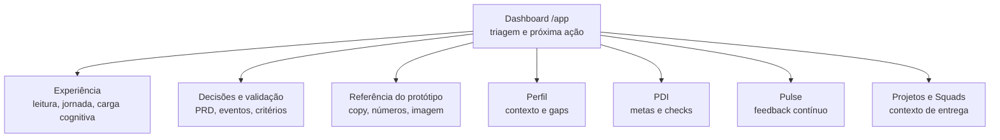

# Dashboard — o que precisa de atenção agora

> Colaborador sabe o que fazer nos próximos 2 minutos. Sem Dashboard, leva 8 min juntando contexto em 5 módulos. Solução: resumo + ações rápidas + próximos passos — tudo nesta tela.

---

## O problema: contexto fragmentado

Sem entrada unificada, colaborador:
- Abre Perfil para saber squad/alocação
- Abre PDI para próximos passos
- Abre Pulse para feedback recente
- Abre Projetos para épico ativo
- **Resultado:** 7-8 min até primeira decisão. Recorrência: 1x/mês (só avaliação).

---

## Solução: estrutura visual em 7 regiões

### 1. Barra superior

Contexto navegacional. Logo, menu (Dashboard ativo), data, notificação, troféu, perfil, logout.

**Papel:** Permanecer visível. Sempre voltar para qualquer módulo sem perder referência.

### 2. Card squad

Uma linha: squad ativa, produto, status (verde = ativo).

**Papel:** Responder "Onde estou?" em 1 segundo.

### 3. Cartões de métricas (5 cartões)

| Cartão | Mostra | Origem |
|--------|--------|--------|
| Alocação | Squad + status | Sistema aloc. |
| Feedback 360° | Recebidos/Enviados + ciclo | Pulse |
| OKRs | % progresso + período | OKR tool |
| Sprints | Contagem ativa | Jira |
| Certificações | Total obtidas | Cert platform |

**Papel:** Sinais rápidos. "Como estou?"

### 4. Coluna esquerda: ações + épico

#### Ações rápidas (4 botões)

| Ação | Destino | Uso |
|------|---------|-----|
| Dar Feedback | Pulse modal | Reconhecer colega |
| Atualizar PDI | `/app/pdi` | Ajustar plano |
| Check-in Semanal | Formulário | Reportar progresso |
| Daily Standup | Calendário | Evento agendado |

**Papel:** Reduzir fricção. Não forçar navegação.

#### Epic em andamento

Épico ativo da sprint. ID, projeto, sprint, prioridade, progresso (%), stories, story points, ETA.

**Papel:** Contexto de trabalho. Ligar técnico a carreira.

### 5. Coluna direita: atividades recentes

Timeline inversa (recente no topo). Cada evento: indicador de cor, texto, timestamp ISO 8601, destino clicável.

**Papel:** Histórico. "O que mudou?"

### 6. Próximos passos (3 cartões)

| Estado | Cor | Exemplo | Ação |
|--------|-----|---------|------|
| PENDENTE | Amarelo | Self-Assessment Q1 — Prazo 10/03 | Abre formulário |
| EM ANDAMENTO | Azul | Certificação AWS SAA — 20% concluído | Link para plataforma |
| AGENDADO | Verde | 1:1 Rafael — Sexta 10:00 | Abre calendário |

**Papel:** Foco. Próximas pendências visíveis.

---

## Por que funciona

**Pergunta central respondida:** "O que precisa de atenção agora?"

Sem Dashboard: resposta vem de 5 módulos distintos → paralelismo.  
Com Dashboard: resposta está nesta tela → ação em 2 min.

**Métrica de sucesso:** `dashboard_viewed` → ação (PDI, feedback, check, próximo passo) em 70% das sessões.

---

## Explore a documentação

:::info Navegação estruturada
Use os cards abaixo para entender cada camada.
:::

### Por que o Dashboard existe

Colaborador sem entrada unificada = contexto fragmentado = abandono.

[Problema e diagnóstico](./dashboard/problema-diagnostico)

---

### Como funciona

Arquitetura em C4 (contexto, contêineres, componentes), fluxos de dados e padrões de leitura.

[Arquitetura e solução](./dashboard/arquitetura-solucao)

---

### Como validar

Hipóteses de tempo reduzido, recorrência semanal, feedback loop e conclusão via próximos passos.

[Validação e métricas](./dashboard/validacao-metricas)

---

### Protótipo e componentes

Inventário de textos literais, cores, componentes e estrutura do mockup.

[Referência do protótipo](./dashboard/referencia-prototipo)

---

### Contrato funcional

Requisitos funcionais, não funcionais, critérios de aceite e Gherkin.

[Decisões e validação](./dashboard/decisoes-validacao)

---

## Próximo passo

**Perfil:** Entender onde você está (squad, alocação, skills, histórico).

[Ir para Perfil →](./perfil-visao-geral)

<AnaliseProduto>

### Tese da tela

O Dashboard não deve competir com Perfil, PDI, Pulse, Projetos ou Squads. Ele deve responder: **“o que merece minha atenção agora?”**

| Função | Decisão de produto |
|--------|--------------------|
| Orientar | Mostrar alocação, ciclo e contexto de entrega sem exigir investigação. |
| Priorizar | Destacar ações rápidas e próximos passos com prazo, estado e destino. |
| Dar memória | Exibir eventos recentes para a pessoa entender o que mudou. |
| Encaminhar | Levar para a tela certa: Perfil, PDI, Pulse, Projetos ou Squads. |

### Leitor e uso esperado

| Público | O que deve extrair desta página |
|---------|---------------------------------|
| Produto / PM | Problema que o Dashboard resolve, tese de valor e fronteiras com outras telas. |
| Design | Hierarquia de leitura, carga cognitiva e intenção de cada bloco da interface. |
| Engenharia | Rotas relacionadas, eventos mínimos e dependências de dados que aparecem nas subpáginas. |
| QA / validação | Critérios de aceite e cenários de uso para teste. |

### Subpáginas

| Página | Use para |
|--------|----------|
| [Experiência do usuário](./dashboard/experiencia) | Descrever como a pessoa lê a tela, decide e avança na jornada. |
| [Decisões e validação](./dashboard/decisoes-validacao) | Registrar hipóteses, critérios, eventos, riscos e contratos para PRD/engenharia. |
| [Referência do protótipo](./dashboard/referencia-prototipo) | Consultar imagem, *copy*, números e elementos observados no mock. |
| [Modais e painéis — inventário](./modais-inventario) | Campos, comportamento, origem dos dados e pendências de todos os modais do módulo. |

### Mapa de navegação

### Fronteira com outras páginas

| Tela | O Dashboard mostra | A tela de detalhe resolve |
|------|--------------------|---------------------------|
| [Visão geral](./perfil-visao-geral) | Sinais resumidos de carreira e desenvolvimento. | Identidade, momento atual, Pulse Intelligence e áreas de foco. |
| [PDI](./perfil-pdi) | Atalho ou pendência de meta/check. | Criação, edição e acompanhamento de metas SMART. |
| [Pulse](./pulse) | Sinal de feedback ou ação para dar feedback. | Feed, filtros, recebidos/enviados e envio de Pulse. |
| [Projetos](./projetos) | Projeto ou épico em andamento. | Lista de iniciativas, papéis, stack, dedicação e progresso. |
| [Squads](./squads) | Squad de alocação. | Estrutura de time, membros e organograma. |

</AnaliseProduto>
