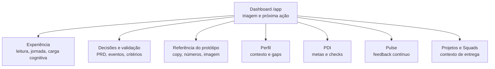

# Dashboard (`/app`)

> O Dashboard é a tela de triagem da trilha Colaborador. Em uma visita curta, a pessoa deve entender contexto de trabalho, prioridade de desenvolvimento e próximo passo.

Use esta página como sumário executivo. As subpáginas separam experiência, decisões de produto e referência do protótipo. A sequência da jornada do utilizador na trilha está no [índice Colaborador](../colaborador) (secção **Como ler esta documentação**).

<AnaliseProduto>

### Tese da tela

O Dashboard não deve competir com Perfil, PDI, Pulse, Projetos ou Squads. Ele deve responder: **“o que merece minha atenção agora?”**

| Função | Decisão de produto |
|--------|--------------------|
| Orientar | Mostrar alocação, ciclo e contexto de entrega sem exigir investigação. |
| Priorizar | Destacar ações rápidas e próximos passos com prazo, estado e destino. |
| Dar memória | Exibir eventos recentes para a pessoa entender o que mudou. |
| Encaminhar | Levar para a tela certa: Perfil, PDI, Pulse, Projetos ou Squads. |

### Leitor e uso esperado

| Público | O que deve extrair desta página |
|---------|---------------------------------|
| Produto / PM | Problema que o Dashboard resolve, tese de valor e fronteiras com outras telas. |
| Design | Hierarquia de leitura, carga cognitiva e intenção de cada bloco da interface. |
| Engenharia | Rotas relacionadas, eventos mínimos e dependências de dados que aparecem nas subpáginas. |
| QA / validação | Critérios de aceite e cenários de uso para teste. |

### Subpáginas

| Página | Use para |
|--------|----------|
| [Experiência do usuário](./dashboard/experiencia) | Descrever como a pessoa lê a tela, decide e avança na jornada. |
| [Decisões e validação](./dashboard/decisoes-validacao) | Registrar hipóteses, critérios, eventos, riscos e contratos para PRD/engenharia. |
| [Referência do protótipo](./dashboard/referencia-prototipo) | Consultar imagem, *copy*, números e elementos observados no mock. |
| [Modais e painéis — inventário](./modais-inventario) | Campos, comportamento, origem dos dados e pendências de todos os modais do módulo. |

### Mapa de navegação

### Fronteira com outras páginas

| Tela | O Dashboard mostra | A tela de detalhe resolve |
|------|--------------------|---------------------------|
| [Visão geral](./perfil-visao-geral) | Sinais resumidos de carreira e desenvolvimento. | Identidade, momento atual, Pulse Intelligence e áreas de foco. |
| [PDI](./perfil-pdi) | Atalho ou pendência de meta/check. | Criação, edição e acompanhamento de metas SMART. |
| [Pulse](./pulse) | Sinal de feedback ou ação para dar feedback. | Feed, filtros, recebidos/enviados e envio de Pulse. |
| [Projetos](./projetos) | Projeto ou épico em andamento. | Lista de iniciativas, papéis, stack, dedicação e progresso. |
| [Squads](./squads) | Squad de alocação. | Estrutura de time, membros e organograma. |

</AnaliseProduto>
