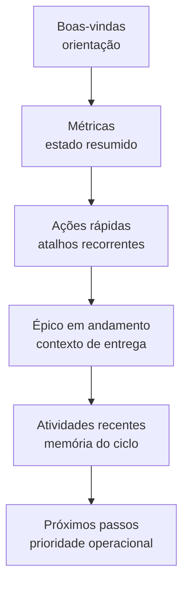
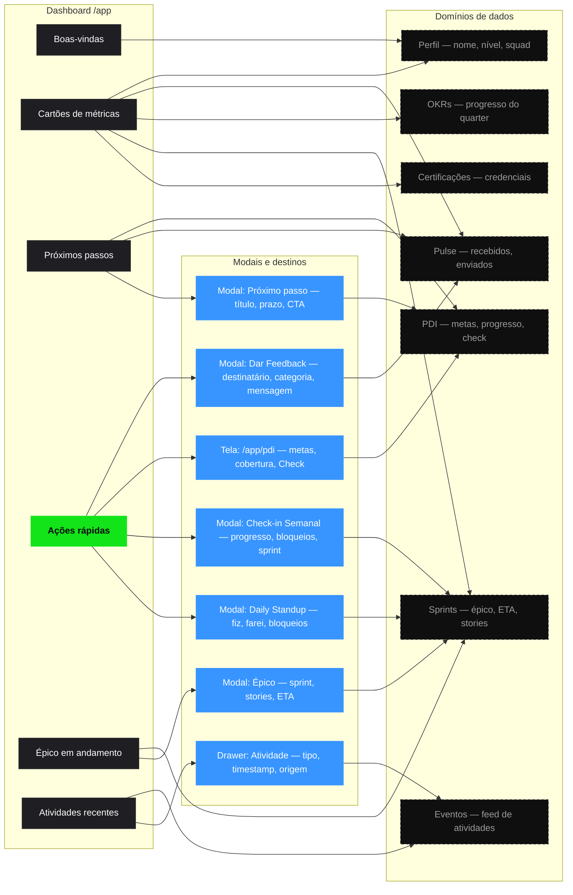
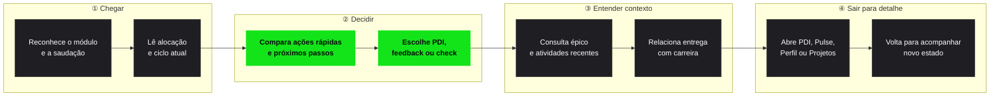

# Dashboard — experiência do usuário

> O Dashboard precisa funcionar em visitas curtas. A pessoa abre `/app`, entende o contexto, escolhe uma ação e sai para a tela certa.

<AnaliseProduto>

### Resultado esperado

O usuário deve sair do Dashboard com uma decisão tomada:

| Decisão | Exemplo no protótipo |
|---------|----------------------|
| Atualizar plano | Ação **Atualizar PDI** ou próximo passo de certificação. |
| Tratar avaliação | Próximo passo **Completar Self-Assessment Q1**. |
| Registrar feedback | Ação **Dar Feedback**. |
| Entender trabalho atual | Bloco **Épico em andamento** com TALENT PLATFORM, Sprint 7 e progresso. |
| Preparar conversa | Próximo passo **1:1 com Rafael Mendes**. |

### Promessa de experiência

Em uma primeira leitura, a tela deve responder:

| Pergunta | Resposta na interface | Critério de clareza |
|----------|----------------------|---------------------|
| Onde estou atuando? | **Squad Plataforma**, **TALENT PLATFORM**, épico e sprint. | O usuário identifica contexto de trabalho sem abrir Projetos. |
| Qual ação está pendente? | **Próximos passos** e ações rápidas. | O usuário escolhe uma ação sem ler o feed inteiro. |
| O que mudou recentemente? | Atividades recentes com timestamp. | O usuário diferencia atualização de PDI, feedback, sprint e OKR. |
| Para onde devo ir? | Atalhos para PDI, Pulse, Projetos, Squads e Perfil. | O usuário entende por que saiu do Dashboard. |

### Arquitetura da informação

### Leitura por camada

| Camada | Bloco | Carga cognitiva | Regra de UX |
|--------|-------|----------------|-------------|
| Orientação | Boas-vindas | Baixa | Dizer onde a pessoa está, sem competir com métricas. |
| Situação | Cartões de métricas | Média | Usar rótulos curtos e contexto temporal quando houver percentual. |
| Ação | Ações rápidas | Baixa | Usar verbo claro e destino previsível. |
| Trabalho | Épico em andamento | Média | Mostrar progresso, prazo e escala sem virar ferramenta de gestão de projeto. |
| Memória | Atividades recentes | Alta | Agrupar eventos por relevância, não apenas por ordem cronológica, se produção permitir. |
| Continuidade | Próximos passos | Baixa | Priorizar pendência acionável com prazo. |

### Fluxo de processo — Dashboard `/app`

O diagrama abaixo cobre a sessão completa: entrada, leitura dos blocos, decisão de ação, destino e retorno ao ciclo. Inclui estados de dado ausente e fallback de erro.

Clique em **Expandir** (ou no próprio diagrama) para abrir em tela cheia com zoom livre.

```mermaid
flowchart LR
  subgraph ENT["Entrada"]
    START(["Abre /app"])
    LOAD{"Dados\ncarregaram?"}
    ERROR["Erro\nrecuperável"]
  end

  subgraph LEIT["Leitura"]
    HERO["Boas-vindas"]
    METRICS["Métricas\nAlocação · OKRs · Sprints"]
    METRICS_EMPTY["Dado ausente\nrótulo + instrução"]
  end

  subgraph PRIO["Prioridade"]
    NEXT{"Próximo\npasso?"}
    NEXT_BLOCK["Próximos passos\npendência · prazo · destino"]
    NO_NEXT["Vazio\nsem passo pendente"]
    ACTIONS["Ações rápidas\nFeedback · PDI · Check-in · Standup"]
  end

  subgraph CTX["Contexto"]
    EPIC{"Épico\nativo?"}
    EPIC_BLOCK["Épico\nsprint · progresso · ETA"]
    NO_EPIC["Vazio\nsem épico ativo"]
    FEED["Atividades recentes\nPDI · Feedback · Sprint · OKR"]
  end

  subgraph DEST["Destino"]
    DECIDE{"Qual sinal\npede ação?"}
    PDI["/app/pdi\nmeta SMART"]
    PULSE["/app/pulse\nfeedback contínuo"]
    PERFIL["/app/perfil\ngaps e foco"]
    PROJECTS["/app/projetos\ncontexto de entrega"]
    CHECK["Check de Evolução\ndentro do PDI"]
  end

  subgraph FIM["Retorno"]
    RETURN["Conclui ação\nna tela de detalhe"]
    BACK(["Volta ao\nDashboard"])
  end

  START --> LOAD
  LOAD -->|"Sim"| HERO
  LOAD -->|"Falha"| ERROR
  ERROR -->|"Retry"| LOAD

  HERO --> METRICS
  METRICS -->|"Disponível"| NEXT
  METRICS -->|"Ausente"| METRICS_EMPTY
  METRICS_EMPTY --> NEXT

  NEXT -->|"Sim"| NEXT_BLOCK
  NEXT -->|"Não"| NO_NEXT
  NEXT_BLOCK --> ACTIONS
  NO_NEXT --> ACTIONS

  ACTIONS --> EPIC
  EPIC -->|"Sim"| EPIC_BLOCK
  EPIC -->|"Não"| NO_EPIC
  EPIC_BLOCK --> FEED
  NO_EPIC --> FEED

  FEED --> DECIDE

  DECIDE -->|"Desenvolvimento"| PDI
  DECIDE -->|"Feedback"| PULSE
  DECIDE -->|"Carreira"| PERFIL
  DECIDE -->|"Entrega"| PROJECTS
  DECIDE -->|"Check"| CHECK

  PDI & PULSE & PERFIL & PROJECTS & CHECK --> RETURN
  RETURN --> BACK
  BACK -->|"Nova sessão"| START

  classDef action   fill:#12E419,color:#09090A,stroke:none,font-weight:bold
  classDef dest     fill:#3895FF,color:#FDFDFD,stroke:none
  classDef empty    fill:#2C2C2D,color:#9C9C9C,stroke:#2C2C2D,stroke-dasharray:4
  classDef error    fill:#7F1D1D,color:#FDFDFD,stroke:none
  classDef terminal fill:#0F0F10,color:#FDFDFD,stroke:#2C2C2D

  class ACTIONS action
  class PDI,PULSE,PERFIL,PROJECTS,CHECK dest
  class METRICS_EMPTY,NO_NEXT,NO_EPIC empty
  class ERROR error
  class START,BACK terminal
```

<DiagramaZoom label="Fluxo de processo — Dashboard /app">

</DiagramaZoom>

#### Legenda

| Cor / estilo | Significado |
|---|---|
| Verde (`#12E419`) | Bloco de ações rápidas — entrada principal para fluxo recorrente |
| Azul (`#3895FF`) | Destinos fora do Dashboard (PDI, Pulse, Perfil, Projetos, Check) |
| Cinza tracejado | Estado vazio ou dado ausente — não bloqueia a página |
| Vermelho escuro | Erro recuperável — bloco isolado, não derruba a tela |
| Escuro neutro | Terminais (início e retorno ao Dashboard) |

---

### Modais e origem dos dados por bloco

Cada bloco do Dashboard carrega dados de uma fonte específica. O diagrama abaixo detalha **qual modal ou tela é acionado**, **quais campos são exibidos** e **de onde o dado vem** (domínio de dados, integração candidata ou estado vazio).

<DiagramaZoom label="Modais e origem dos dados — Dashboard /app">

</DiagramaZoom>

#### O que cada modal contém

| Modal / destino | Acesso | Campos exibidos | Fonte de dados |
|-----------------|--------|-----------------|----------------|
| **Dar Feedback** | Ação rápida | Destinatário, categoria (Pulse), mensagem, vínculo com competência | Domínio Pulse — POST `/pulse` |
| **Atualizar PDI** | Ação rápida | Tela completa `/app/pdi`: metas, cobertura, Check | Domínio PDI e metas |
| **Check-in Semanal** | Ação rápida | Progresso, bloqueios, sprint atual, comentário livre | Domínios Sprint + PDI |
| **Daily Standup** | Ação rápida | O que fiz · farei · bloqueios; hora e squad pré-preenchidos | Domínio Sprint / Squads |
| **Detalhe do próximo passo** | Clique em item de Próximos passos | Título, estado, prazo, descrição curta, CTA com destino | Domínio PDI (check pendente) ou Performance (self-assessment) |
| **Detalhe do épico** | Clique no bloco Épico | Épico, sprint, prioridade, progresso, stories, story points, ETA | Domínio Projetos — integração candidata com ferramenta de delivery |
| **Drawer de atividade** | Clique em item do feed | Tipo de evento, timestamp, descrição, link para tela de origem | Domínio Eventos do módulo |

#### Pendências de origem de dados

| Bloco | Dado | Status | Ação necessária |
|-------|------|--------|-----------------|
| Cartão OKRs | Progresso do quarter | ⚠ Hipótese | Definir fonte: RHIS, input manual ou integração OKR tool |
| Cartão Certificações | Credenciais obtidas | ⚠ Hipótese | Definir fonte: ATS, badge interno ou upload manual |
| Épico em andamento | Stories, ETA, sprint | ⚠ Candidato | Integração com ferramenta de delivery (Jira, Linear, etc.) — não implementar agora |
| Feed de atividades | Taxonomia de eventos | ⚠ Pendente | Definir schema: tipo, domínio de origem, retenção, ordenação |
| Próximos passos | Regra de ordenação | ⚠ Decisão aberta | Quem decide a prioridade quando há múltiplas pendências? |

---

### Jornada de uso

<DiagramaZoom label="Jornada de uso — Dashboard /app">

</DiagramaZoom>

### Princípios de design

| Princípio | Aplicação no Dashboard |
|-----------|------------------------|
| Visibilidade do estado | Cartões e próximos passos mostram ciclo, progresso e pendência. |
| Correspondência com o mundo real | Épico, sprint, 1:1 e certificação usam linguagem do dia a dia do colaborador. |
| Reconhecimento em vez de memória | A pessoa vê atividades recentes sem depender de anotações externas. |
| Prevenção de erro | Ações rápidas precisam indicar destino e estado antes de mudar contexto. |
| Consistência | Feedback contínuo, avaliação formal e PDI devem ter rótulos distintos. |

</AnaliseProduto>
