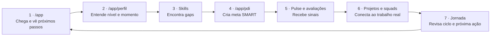

# Colaborador (`/app`)

> Uma pessoa tentando evoluir na carreira precisa, nessa ordem: saber o que fazer agora, entender por que aquilo importa, criar um plano e acumular evidências de evolução.

Esta página orienta a trilha. Cada seção tem um papel na jornada; as páginas filhas documentam a tela, a *copy* do protótipo e as hipóteses que ainda precisam virar PRD.

:::note Escopo atual

A entrega cobre **somente Colaborador** (`/app/*`). RH Tech People (`/hr/*`) fica fora da implementação e aparece apenas como referência futura.

:::

---

## Como ler esta documentação

**Hub vs páginas de detalhe.** Esta página sintetiza a jornada na ordem das perguntas do utilizador. Cada outra entrada cobre **uma superfície do produto** (página, rota ou separador) e usa `<AnaliseProduto>` para decisões, hipóteses e fronteiras, e `<ReferenciaProtótipo>` para *copy* e elementos observados no mock.

**Perfil: uma URL no protótipo, várias páginas aqui.** `Visão geral`, `Jornada`, `Skills` e `Experiência` partilham **`/app/perfil`** no router do mock: muda o separador na UI, não o caminho. Na documentação, cada separador tem **página própria** para PRD e critérios de aceite sem misturar contextos. O *trade-off* de UX está descrito em [Visão geral](./perfil-visao-geral).

**Menu lateral do site.** O sumário agrupa por tema (Dashboard e subpáginas, Pulse, Perfil, Skills, inventário de modais). Essa ordem serve à **navegação por área**, não à **sequência da jornada**. Para a sequência, usa a tabela na secção **Leitura rápida da jornada** ou o fluxograma em **História ponta a ponta** (ambas abaixo nesta página).

---

## Leitura rápida da jornada

| # | Pergunta do usuário | Página | Saída esperada |
|---|---------------------|--------|----------------|
| 1 | "O que preciso fazer agora?" | [Dashboard](./dashboard) | Próximo passo claro: PDI, check-in, feedback ou pendência. |
| 2 | "Onde estou na carreira?" | [Visão geral](./perfil-visao-geral) | Nível, squad, quarter, progresso e áreas de foco entendidos. |
| 3 | "Qual gap está travando minha evolução?" | [Matriz](./skills/matriz) · [Hard](./skills/hard) · [Soft](./skills/soft) · [Gaps](./skills/gaps) | Gap priorizado com nível atual, alvo e motivo. |
| 4 | "Que compromisso vou assumir?" | [PDI](./perfil-pdi) | Meta SMART criada ou atualizada, vinculada a um gap. |
| 5 | "Tenho evidência de que evoluí?" | [Pulse](./pulse) · [Performance Review](./perfil-performance-review) · [Projetos](./projetos) · [Squads](./squads) · [Experiência](./perfil-experiencia) | Feedback, avaliações e contexto conectados à narrativa de carreira. |
| 6 | "O que mudou e qual é o próximo passo?" | [Jornada](./perfil-jornada) · [Badges](./perfil-jornada-badges) | Linha do tempo, conquistas e próximo ciclo visíveis. |

---

## História ponta a ponta

---

## 1. Dashboard: decidir a primeira ação

**Página:** [Dashboard (`/app`)](./dashboard)

O Dashboard é a porta de entrada. Não descreve a carreira inteira — reduz uma dúvida: **qual ação merece atenção agora?**

| Bloco | O que mostra | Como empurra a jornada |
|-------|-------------|------------------------|
| Boas-vindas | Orientação de contexto e módulo | Cria ancoragem sem competir com métricas. |
| Cartões de métricas | Alocação, Feedback 360°, OKRs, Sprints, Certificações | Sinais de trabalho sem exigir análise profunda. |
| Ações rápidas | **Dar Feedback**, **Atualizar PDI**, **Check-in Semanal**, **Daily Standup** | Leva para ação, não para leitura passiva. |
| Próximos passos | Self-assessment, certificação, 1:1 com prazo | Define urgência sem exigir que o usuário calcule prioridade. |

**Validação:** em teste, o usuário deve abrir `/app` e responder em menos de 1 minuto: "qual ação você faria primeiro e por quê?"

---

## 2. Visão geral: entender o momento de carreira

**Página:** [Visão geral (`/app/perfil`)](./perfil-visao-geral)

Após escolher uma ação, o usuário precisa de contexto. A visão geral responde: **em que ponto da carreira estou e qual evolução está sendo sugerida?**

| Bloco | O que mostra | Próxima leitura |
|-------|-------------|-----------------|
| Identidade | Nível, squad, gestor, tribe e modelo de trabalho | Confirma papel e contexto. |
| Momento atual | Quarter, progresso, OKRs, pulses recebidos, dias restantes | Mostra o ciclo em andamento. |
| Traço de jornada | Conquista atual e progresso para a próxima | Abre caminho para [Jornada](./perfil-jornada) e [Badges](./perfil-jornada-badges). |
| Pulse Intelligence | Reconhecimentos recentes como sugestão de meta | Conecta [Pulse](./pulse) ao [PDI](./perfil-pdi). |
| Áreas de foco | Gaps priorizados com nível atual e alvo | Leva para [Gaps](./skills/gaps). |

**Risco de produto:** se virar currículo estático, perde o papel de orientar o próximo passo.

---

## 3. Skills: chegar ao gap certo

As páginas de Skills levam o usuário de "preciso evoluir" a "sei exatamente onde está a lacuna".

### Matriz de competências

**Página:** [Matriz de competências](./skills/matriz)

A matriz cria o modelo mental **Atual vs Esperado** nas dimensões de carreira — Design de Soluções, Estratégia Técnica, Arquitetura Frontend, Performance, Mentoria, Colaboração e Inovação.

**Papel na jornada:** dar base para o usuário confiar no diagnóstico. Sem matriz, o gap parece opinião solta.

### Hard Skills

**Página:** [Hard Skills](./skills/hard)

Detalha competências técnicas: React, TypeScript, arquitetura frontend, performance, testes e ferramental.

**Papel na jornada:** mostrar quais capacidades técnicas sustentam a evolução de nível e quais exigem ação prática.

### Soft Skills

**Página:** [Soft Skills](./skills/soft)

Traduz comportamentos em critérios observáveis: comunicação, influência, liderança, colaboração e resolução de conflitos.

**Papel na jornada:** evitar que competências comportamentais fiquem abstratas — precisam gerar meta, evidência e feedback.

### Gaps

**Página:** [Gaps](./skills/gaps)

Gaps é a página de decisão dentro de Skills. Responde: **qual lacuna ataco primeiro e como isso vira PDI?**

| Gap no protótipo | Leitura de produto | Continuação |
|------------------|--------------------|-------------|
| **React Advanced Patterns** | Técnico com potencial de elevar referência em frontend. | Criar meta ou mentoria no PDI. |
| **RxJS & Programação Reativa** | Já relacionado a uma meta ativa. | Acompanhar progresso em [PDI](./perfil-pdi). |
| **Security & OAuth** | Técnico conectado ao contexto de autenticação. | Validar se meta e projeto contam a mesma história. |

**Validação:** pedir ao usuário para escolher um gap e criar uma meta. Se ele não entende por que o gap importa, a tela ainda está fraca.

---

## 4. PDI: transformar diagnóstico em compromisso

**Página:** [PDI (`/app/pdi`)](./perfil-pdi)

O PDI pega diagnóstico, feedback e ambição e transforma em compromisso rastreável.

| Parte da página | O que mostra | Por que importa |
|-----------------|-------------|-----------------|
| Resumo de metas | Total, concluídas, em andamento, progresso médio | Estado do plano sem abrir meta por meta. |
| Cobertura por competência | Quantos gaps têm ou não têm meta | Evita PDI desconectado do diagnóstico. |
| Nova Meta SMART | Título, pilar, prioridade, prazo, critérios SMART | Força clareza de ação e medida. |
| Vínculo com gap | Campo **Vincular a Gap Identificado** | Preserva rastreabilidade entre diagnóstico e plano. |
| Check de Evolução | Autoavaliação trimestral com pilares e respondentes | Conecta plano ao ciclo de avaliação. |
| Histórico de checks | Q4 2025, Q3 2025, Q2 2025… | Mostra evolução ao longo do tempo. |

**História que a página precisa contar:** "Tenho gaps. Alguns já têm meta; outros não. Vou criar ou ajustar metas SMART e acompanhar progresso até o próximo check."

**Risco de produto:** PDI que aceita metas sem relação com gaps vira lista genérica de tarefas.

---

## 5. Pulse: sinal contínuo entre ciclos formais

**Página:** [Pulse (`/app/pulse`)](./pulse)

Pulse é reconhecimento e feedback contínuo entre pares. Não substitui Performance Review — alimenta a narrativa com sinais do dia a dia.

| Fluxo | O que registra |
|-------|----------------|
| Receber Pulse | Reconhecimento de comportamento ou entrega específica. |
| Enviar Pulse | Registro de reconhecimento para outra pessoa. |
| Filtrar recebidos/enviados | Separação entre o que recebi e o que enviei. |
| Pulse Intelligence | Reconhecimentos recorrentes sugerem meta ou força de carreira. |

**Decisão de produto:** Pulse precisa deixar claro se é reconhecimento, feedback ou sinal de análise. Misturar com avaliação formal cria desconfiança.

---

## 6. Performance Review: formalizar avaliação

**Página:** [Performance Review](./perfil-performance-review)

Performance Review conta a parte formal: autoavaliação, manager, 360° time, radar comparativo, *blind spots* e *hidden strengths*.

| Bloco | Pergunta respondida |
|-------|---------------------|
| Autoavaliação | Como avalio minhas competências? |
| Manager | Como meu líder avalia essas competências? |
| 360° Time | Como pares percebem minha atuação? |
| Radar comparativo | Onde há alinhamento ou diferença de percepção? |
| Blind spots / hidden strengths | O que subestimo ou superestimo sobre mim? |

**Papel na jornada:** confirmar ou tensionar o PDI. Se o review aponta lacuna e o PDI não responde, existe quebra de produto.

---

## 7. Projetos, squads e experiência: provar contexto

Evolução de carreira não acontece no vazio. Estas páginas mostram onde a pessoa aplicou habilidades.

### Projetos

**Página:** [Projetos (`/app/projetos`)](./projetos)

Mostra iniciativas, estado, dedicação, papel, stack, progresso e equipe.

**Uso na jornada:** justificar metas e evolução com trabalho real.

### Squads

**Página:** [Squads (`/app/squads`)](./squads)

Mostra time, estrutura e organograma.

**Uso na jornada:** explicar colaboração, influência, feedback e projetos *cross-squad*.

### Experiência

**Página:** [Experiência profissional](./perfil-experiencia)

Transforma cargos, projetos e histórico em narrativa de carreira.

**Uso na jornada:** conectar passado, atuação recente e ambição de evolução.

---

## 8. Jornada e badges: fechar o ciclo

### Jornada

**Página:** [Jornada (`/app/perfil`)](./perfil-jornada)

Mostra linha do tempo, marcos e ciclos. Responde: **o que mudou desde o último ciclo e o que vem agora?**

**Papel na experiência:** fechar o ciclo aberto no dashboard. O usuário não deve sentir que está sempre recomeçando do zero.

### Badges e conquistas

**Página:** [Badges e conquistas](./perfil-jornada-badges)

Reconhecimento visual para marcos atingidos.

**Papel na experiência:** reforçar progresso — desde que os critérios sejam claros. Badge sem critério vira decoração.

---

## Mapa de continuidade entre páginas

| Se o usuário está em... | Próxima página provável | Motivo |
|-------------------------|-------------------------|--------|
| [Dashboard](./dashboard) | [Visão geral](./perfil-visao-geral) ou [PDI](./perfil-pdi) | Entender contexto ou executar ação rápida. |
| [Visão geral](./perfil-visao-geral) | [Gaps](./skills/gaps) ou [Pulse](./pulse) | Investigar recomendação de foco ou origem dos sinais. |
| [Gaps](./skills/gaps) | [PDI](./perfil-pdi) | Transformar lacuna em meta. |
| [PDI](./perfil-pdi) | [Jornada](./perfil-jornada) ou [Performance Review](./perfil-performance-review) | Ver ciclo de evolução ou avaliação formal. |
| [Pulse](./pulse) | [Visão geral](./perfil-visao-geral) ou [PDI](./perfil-pdi) | Usar reconhecimento como insight ou meta sugerida. |
| [Projetos](./projetos) | [Experiência](./perfil-experiencia) | Transformar atuação em narrativa de carreira. |
| [Squads](./squads) | [Projetos](./projetos) ou [Pulse](./pulse) | Entender contexto de colaboração. |
| [Jornada](./perfil-jornada) | [Dashboard](./dashboard) | Voltar para a próxima ação do ciclo. |

---

## O que precisa ficar claro no PRD

| Tema | Pergunta de decisão |
|------|---------------------|
| Próxima ação | Como o sistema escolhe qual ação aparece primeiro no dashboard? |
| Gaps | Quem define nível atual, nível esperado, prioridade e validade do gap? |
| PDI | Toda meta precisa de vínculo com gap ou metas independentes são permitidas? |
| Pulse | Quem vê o quê: recebido, enviado, sinal de análise? |
| Avaliações | O que é privado, anônimo, visível ao manager e visível à organização? |
| Projetos e squads | Qual fonte de dados é confiável para contexto de atuação? |
| Jornada | O que conta como marco real de evolução? |
