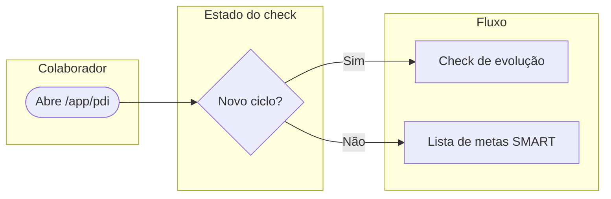
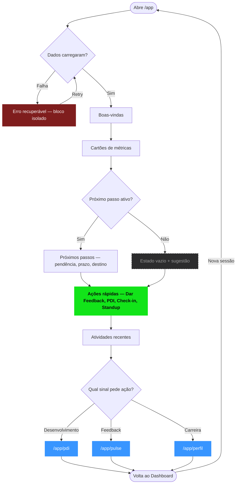
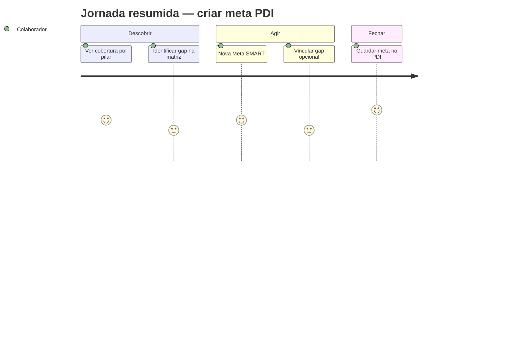
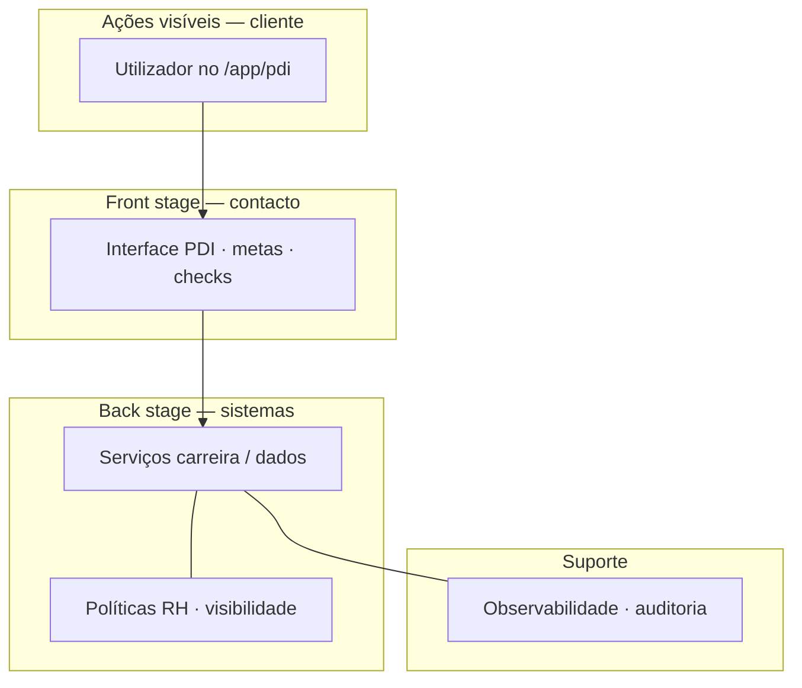
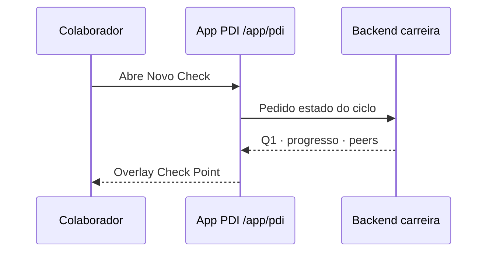

# Diagramas e jornadas

Este site usa **[Mermaid](https://mermaid.js.org/)** através do tema oficial `@docusaurus/theme-mermaid`. Em qualquer página **`.mdx`** pode declarar diagramas dentro de um bloco de código com a linguagem **`mermaid`** — são renderizados no *build* e no cliente.

Syntax highlight e variantes suportadas seguem a [documentação do Mermaid](https://mermaid.js.org/syntax/flowchart.html); abaixo há **modelos** alinhados ao Módulo de Carreira (PM, UX, narrativa do protótipo).

---

## Fluxograma de processo

Útil para **decisões**, **estados** ou **handoffs** entre telas ou equipes. Use `flowchart TD` (cima para baixo) para fluxos lineares com ramificações; `flowchart LR` quando o espaço horizontal for mais legível.

### Exemplo simples — PDI: novo ciclo ou lista

### Exemplo completo — Dashboard `/app` com estados e fallbacks

Fluxo com **entrada**, **leitura por bloco**, **decisão de destino**, **estados vazios**, **erro recuperável** e **retorno ao ciclo**. Referência canônica; o diagrama completo está em [Dashboard — experiência do usuário](./colaborador/dashboard/experiencia).

---

## Mapa de experiência — jornada (*user journey*)

O tipo **`journey`** resume **fases**, **passos** e uma **nota subjectiva** (1–5) por linha — bom para *workshops* ou síntese de pesquisa.

---

## Blueprint de serviço (*service blueprint*, simplificado)

Camadas **visível / contacto / suporte** num único diagrama (equivalente conceptual ao *blueprint* clássico). Ajuste rótulos aos vossos atores reais.

---

## Diagrama de sequência (*touchpoints*)

Para **ordem temporal** de mensagens entre pessoa, UI e API.

---

## Como usar noutras páginas

1. Garantir que o ficheiro é **`.mdx`** (não só `.md`, se o projeto não processar Mermaid nos *plain* Markdown).
2. Inserir um **bloco de código** Markdown: abrir com três crases, a palavra *mermaid* nessa primeira linha, o corpo do diagrama, e fechar com três crases.
3. Validar sintaxe na [live editor](https://mermaid.live/) se o diagrama não aparecer ou o *build* falhar.

:::tip Convenções da doc Hunter

Preferir **frases curtas** nos nodos, **PT** nos títulos de diagrama quando a página for PT, e **nome de rotas** entre crases mentais (`/app/pdi`) só quando ajudam o leitor técnico — tal como nas restantes páginas do módulo.

:::
